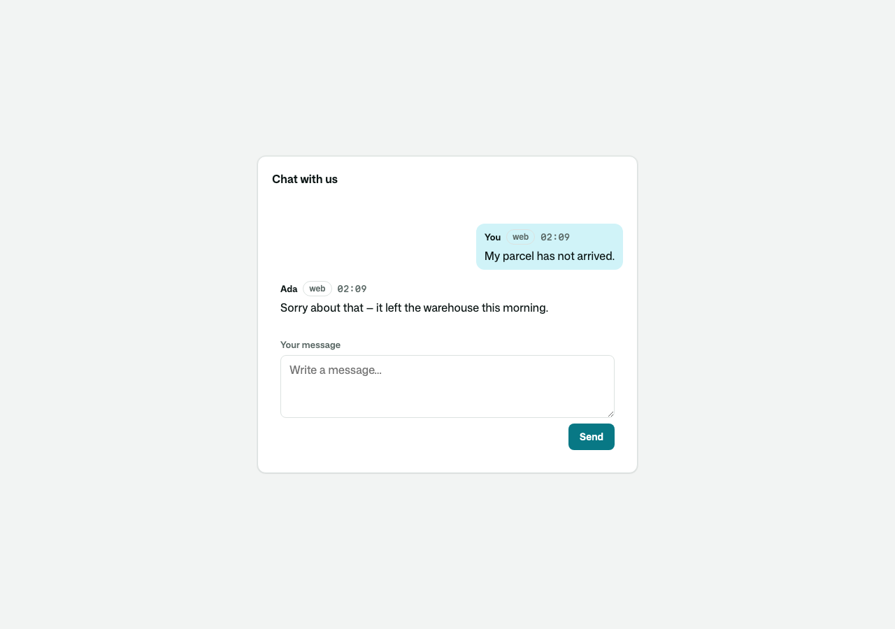
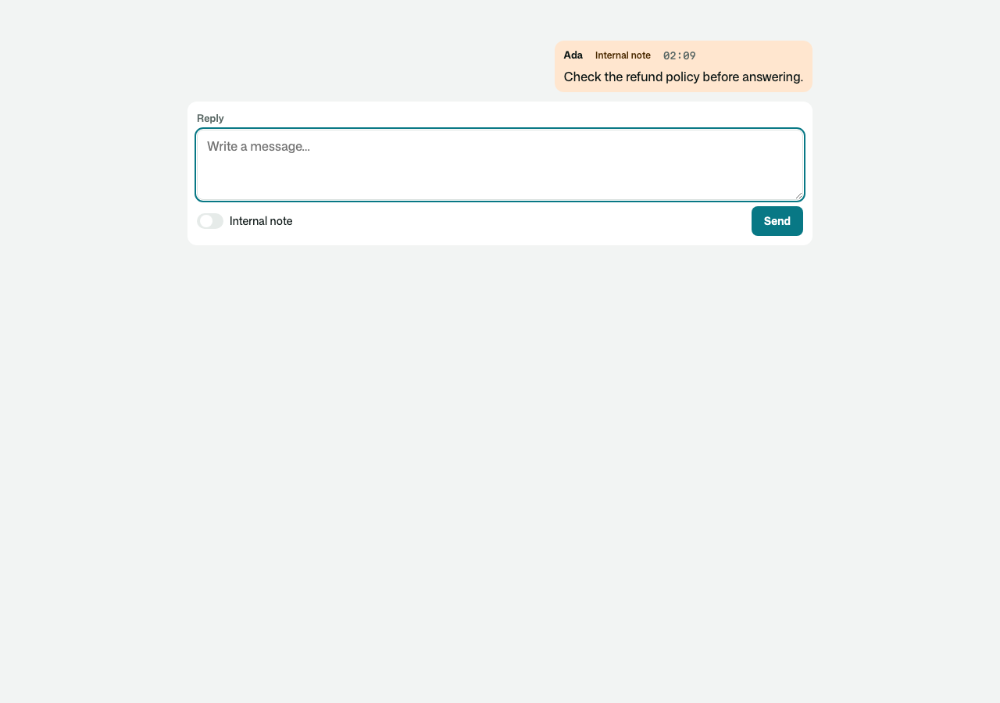
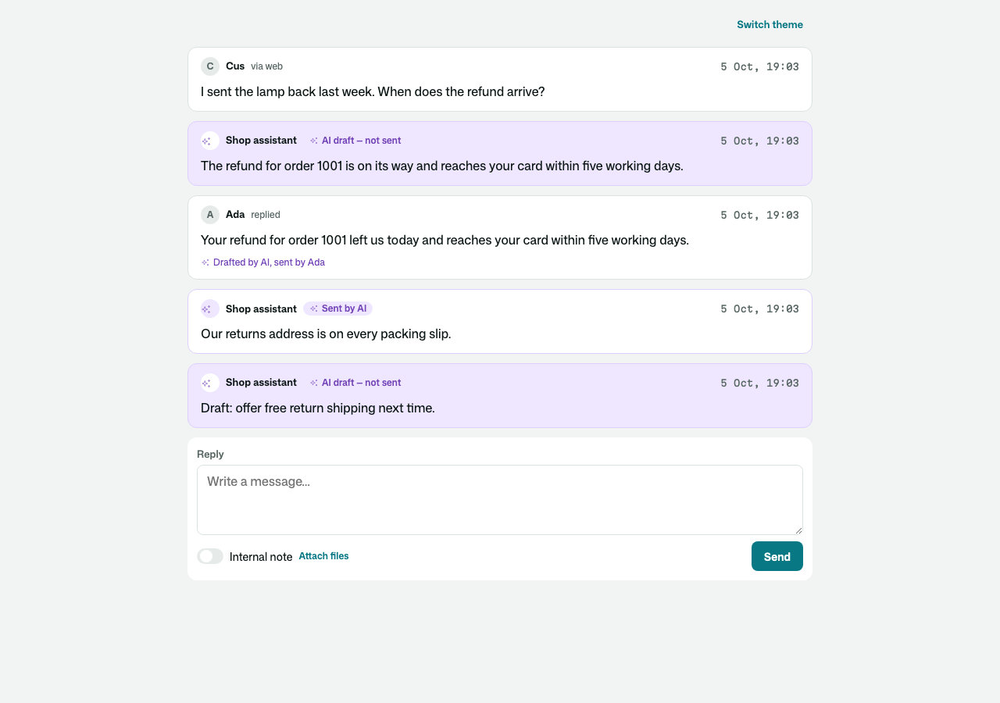
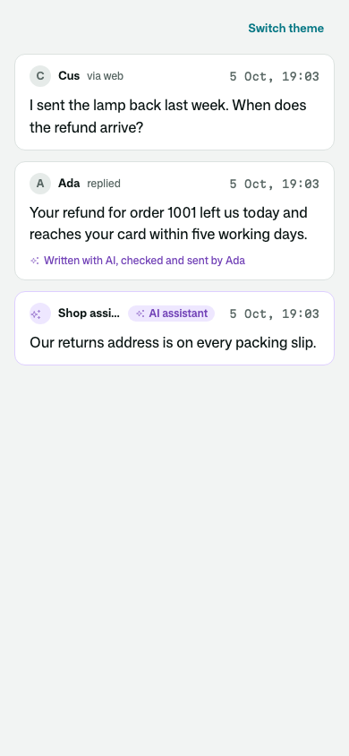
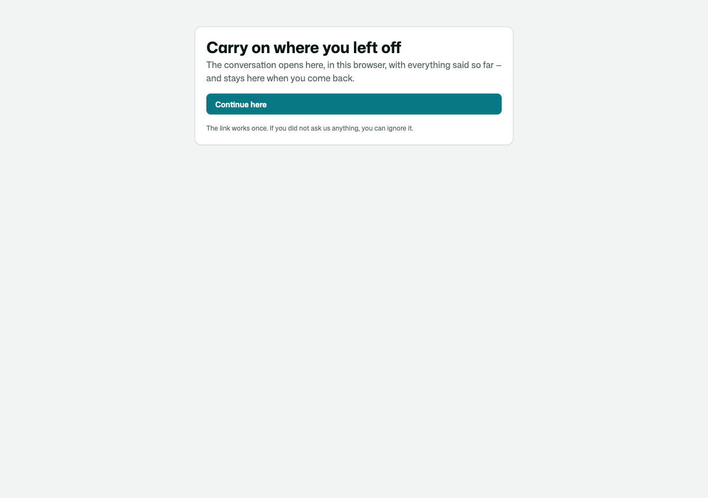
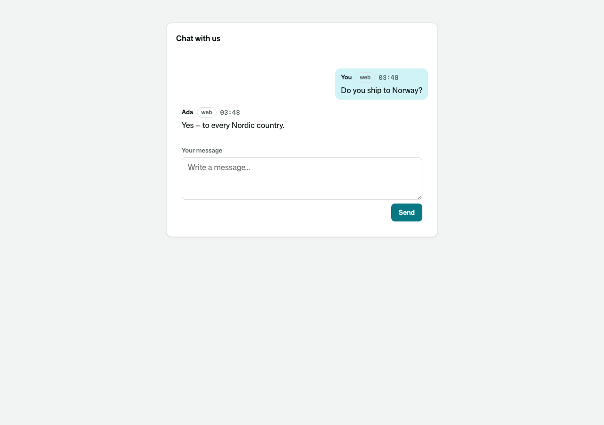
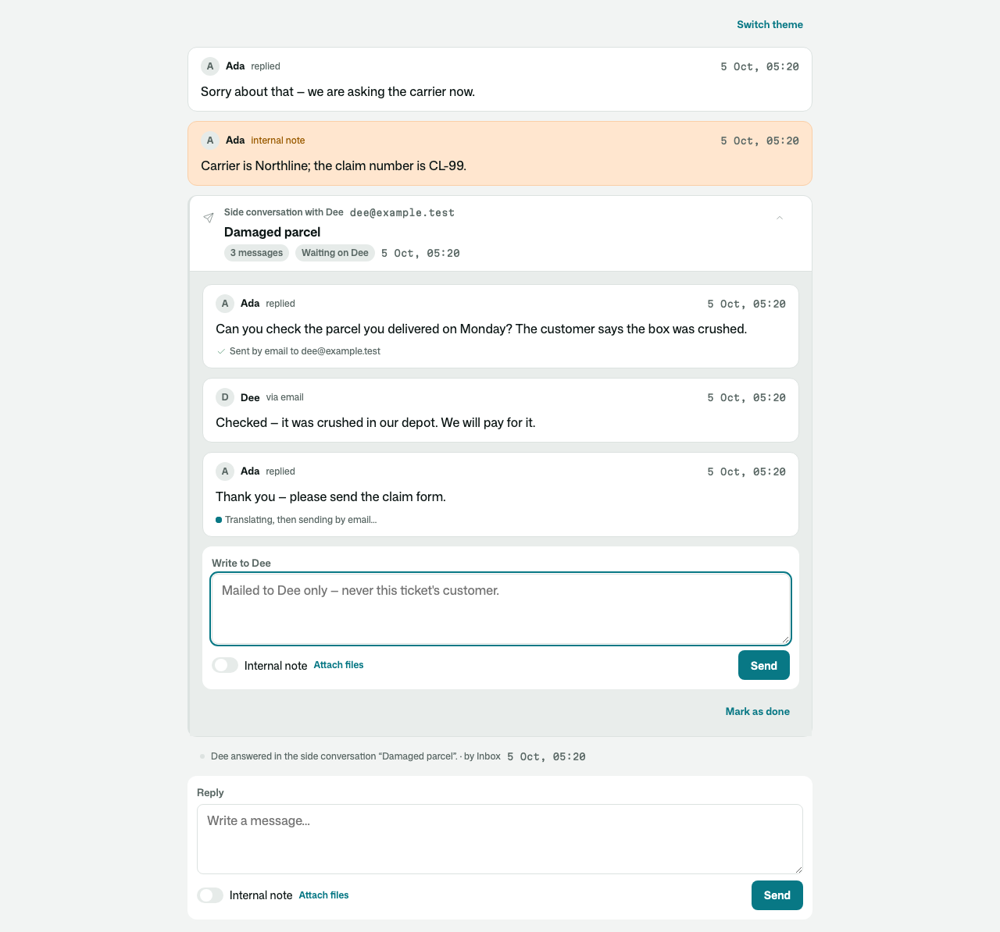
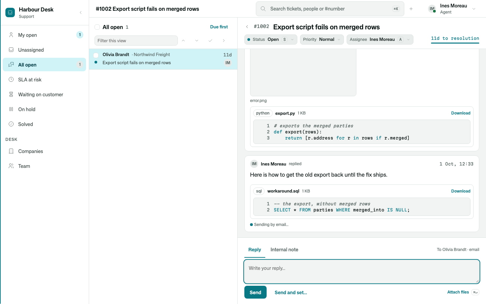
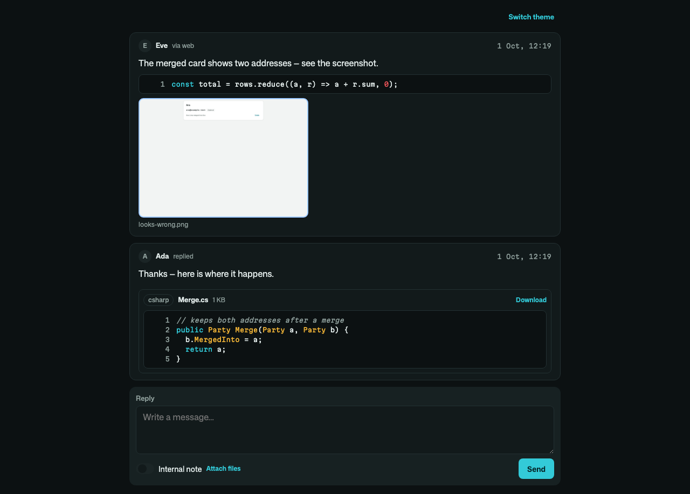
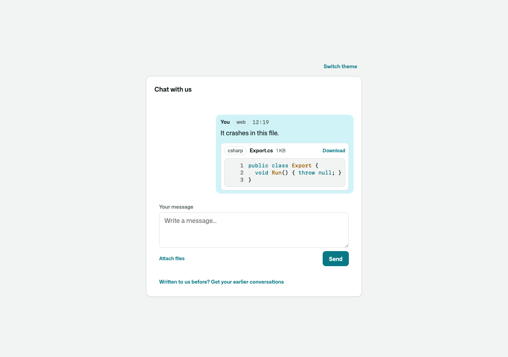

# Osysharp.Conversations

One conversation with a customer, whichever way they reach you — the chat on your site, the portal, and (with the channel
adapters) email and text — kept as **one ordered timeline**: their messages, your replies, your team's internal notes,
an AI's drafts and the things that happened ("assigned to Ada", "marked solved"). Who may see each entry is a **rule**,
not a toggle in a composer: a note never reaches a customer, whatever your app grants and whichever way a row is read.

It is the core a helpdesk, a CRM's service module or a contact centre writes into. It has no tickets, statuses, queues or
SLA clocks — those are yours (or the Inbox kit's), reading the timeline and writing their facts with `Record`.

```osy
// app.osy
use Osysharp.Identity@0;
use Osysharp.Conversations@0;
use Osysharp.Workflow;
use Osysharp.Ui;
```

```osy
// model/desk.osy
using Osysharp.Identity;
using Osysharp.Conversations;

[Role] enum AppRole { Authenticator, Agent }

// The kit asks who your staff are — only you know.
policy IsConversationStaff => RoleGrant.Any(g => g.Member == user && g.Role == AppRole.Agent);

// …and what they may do. The kit grants the customer's side; you grant your team's.
partial entity Conversation { security { allow read, create, update when IsConversationStaff; } }
partial entity Message      { security { allow read, create, update when IsConversationStaff; } }
partial entity MessageAttachment { security { allow read, create when IsConversationStaff; } }   // their files
// (and Participant, ConversationEntry, ConversationEvent, MessageText, ContactPoint, Party)

// The customer's chat, signed out or in.
[Page("/chat")] [AllowAnonymous] [Render(CSR)]
component ChatPage() { render { ConversationWidget(); } }

// A conversation as an agent works it.
[Page("/desk/{id}")] [Authorize(IsConversationStaff)] [Render(CSR)]
component DeskPage(Guid id) {
  render { ConversationPresenceChip(id, desk: true); ConversationTranscript(id, desk: true); ConversationComposer(id, desk: true); }
}
```

| The customer's chat | The desk, with a note |
|---|---|
|  |  |

## What you get

- **One order.** Every entry takes the next place on its conversation's timeline (`Sequence`), whatever its kind — a
  reply, a note and an event written together are in the order they happened.
- **Visibility you cannot get wrong.** `Customer`, `Internal`, `AiInternal`, fixed when written for everyone. Approving an
  AI draft posts a new message pointing back at it.
- **What an AI wrote, in a colour of its own.** A draft waiting for a person, a reply an AI sent, and a reply a person
  sent from its draft each carry the AI's mark, in the kit's `ConversationAi` token, light and dark. The customer is told
  plainly too: "AI assistant" on a reply it sent, and "Written with AI, checked and sent by Ines" on one a person
  approved. Your theme re-colours it like any other token.
- **Parties you shape.** `Party` is a base: derive your own (`Customer : Party`, or `Party : Osysharp.Conversations.Party`
  — the same name, by namespace) and make the kit create it (`PartyKinds.New`). Contact points are claims until a proof
  flow verifies them; nobody but the sign-in flow links a party to an account.
- **Live.** The transcript updates as entries are written (through the reader's own rules — a note's arrival reaches a
  customer's page as nothing); typing shows both ways; the desk sees which colleagues have a conversation open.
- **Read state.** `Unread(c)` counts what the caller has not seen, never their own; the transcript marks it read.
- **Accounts and the portal.** A signed-in customer speaks as the party linked to their account (`CallerParty`). Call
  `LinkSignedInAccount(account, account.Email, account.EmailVerifiedAt != null)` from your `AccountEvents.SignedIn`.
  With a proven address it links the party holding that address PROVEN, or makes the account one of its own. An
  unproven address links nothing. Your party subtype must grant
  the sign-in flow `allow read, create, update when IsAuthenticator`, because grants are never inherited from the base.
- **Never answer twice.** `AnsweredSince(c, seen)` is a colleague's customer-visible reply written after the place you
  last had on screen. Ask it before sending, and tell the writer who got there first.
- **They left the chat? They get the answer by mail.** A reply in the chat that nobody has read after ten minutes
  (`ContinueByAfter`) is mailed to the address they left — every unread reply in ONE mail, with a link that continues the
  conversation in any browser, once. Their answer to the mail lands in the same conversation.
- **Proven, not claimed.** An address typed in the chat is a claim; a code mailed to it and typed back is proof — and
  a proof makes the visitor the customer the desk already knows (their parties merge). The desk merges duplicates by
  hand from `PartyCard`, and undoes it. Signing in links the party whose address is PROVEN, never a claim.
- **In their language.** A customer's message keeps its original and gains a redacted copy in the desk's language; a
  reply reaches them in theirs, recorded as what they were sent. Use the app's own model
  (`Osysharp.Conversations.MachineTranslation`) or bring your own translator (`IConversationTranslator`). Translation
  never holds up a message: it runs just after the message is stored, a failing translator is tried again, and when it
  stays down the desk reads the original and is told why. The chat widget's own words are yours to translate.
- **No card numbers at rest.** Every message — any channel, either direction — is scrubbed as it is stored
  (`[card ••••1234]`), and redacted further before anything reaches a model or the search index.
- **Searchable by meaning** (`SearchConversations`, `SimilarConversations`) over those redacted copies — once the app
  has an embedder. Its tests prove what a search finds, and that an erased customer is in none, with the offline
  embedder from `Osysharp.Memory.Testing`.
- **Forgotten on request, everywhere.** `ErasePartyData` reaches every copy — originals, translations, renderings,
  subjects, contact points, and the mail and text outboxes; `KeepFor` erases old conversations; `ExportPartyData`
  answers a right-of-access request.
- **Files on messages.** A customer pastes a screenshot into the chat (signed out or in), drops a log on it, or
  picks files; the desk sends an annotated one back. Each file is readable exactly where its message is — a note's
  files stay the team's. Pictures show in place and open large; source code is previewed with line numbers and
  coloured; a ZIP is listed; everything is a download, and HTML/SVG are never rendered. What a file is comes from its
  bytes, and the size limits (`MaxFileBytes`, `MaxMessageBytes`) are sentences. A pasted ``` snippet is code, and what
  a mail client quoted under a reply folds behind "Show quoted text".
- **Copied in, and split off.** The desk copies a customer's colleague in by their address (`CopyInByAddress`) — sent
  every reply from then on, reading the conversation where the customer does — and takes them off again. A second
  question asked in one thread is split off into a conversation of its own (`SplitOff`): the message moves, with its
  files and its mail thread, its writer the new conversation's customer; a legal hold on the old one still keeps it.
  The app says who may split (`partial entity ConversationSplit { security { … } }`).
- **Side conversations.** Ask somebody else without leaving the conversation: mail a supplier or a carrier about it
  (`StartSideConversation`), or open a thread inside the team. It sits on the conversation's timeline as a card that
  opens into its own thread; their answer by mail lands in it, and the desk is told. The person written to sees only
  that side conversation — never the conversation it is beside, its customer, or even which one it is — and the
  customer never sees the side one. A bounce says the mail did not arrive.
- **Your own kind of party says who reads it** — grants are never inherited, so add
  `allow read when IsAnonymous || IsAuthenticated where IsCustomerParty(Id);` to `Customer : Party`.

| What an AI wrote, on the desk | …and on the customer's phone |
|---|---|
|  |  |

| They left — the answer by mail, a link that works once | …and on their phone, the whole conversation |
|---|---|
|  |  |

| A side conversation with the carrier, on the customer's thread |
|---|
|  |

| A mailed screenshot and script, on the desk's thread | The agent's reply, with the file they dropped on it |
|---|---|
|  |  |
|  |  |

## Source and tests

The kit is ordinary Osy# in `model/`, and its tests are its specification. Each security promise
(`security.test.osy`, `parties.test.osy`, `channels.test.osy`, `continuation.test.osy`) is checked to fail when its
rule is taken out.
