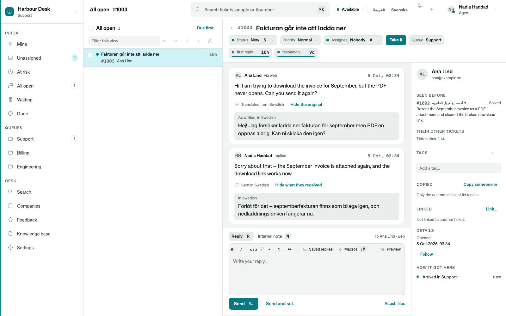
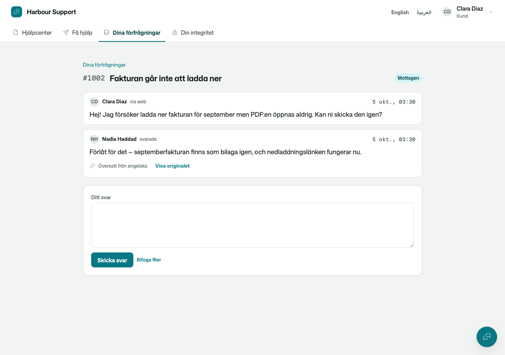
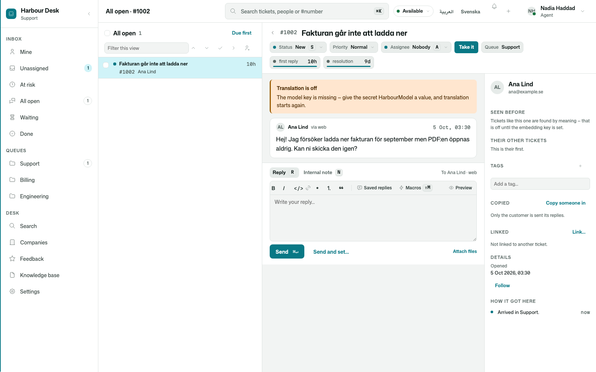

# Osysharp.Conversations.MachineTranslation

**Support in every language, with the model you already have.** Your team reads every customer message in its own
language and writes in it; each customer reads the answer in theirs. The translation runs through your app's own model,
with your key, router and budget — no translation service to sign up for, and no customer text sent anywhere your app
does not already send it.





## Use it

```osy
app Desk {
  use Osysharp.Conversations@0;
  // Osysharp.Conversations.MachineTranslation is not written: it arrives by itself, because the app uses what it completes (`osy lock` says so)
  model "model/**/*.osy";
}
```

```osy
using Osysharp.Conversations;
using Osysharp.Conversations.MachineTranslation;
using Osysharp.MachineTranslation;

app.Conversations = new ConversationsSetup {
  Translator = new ModelConversationTranslator { Translator = new ModelTranslator { KeySecret = "ModelKey" } },
  CanonicalLanguage = "en",
};
```

## What you get

- **Both texts, always.** Every message keeps what was written. The team reads a copy marked "Translated from Swedish"
  with the original a click away; a reply says "Sent in Swedish", with exactly what the customer received a click away.
- **Languages told offline first.** Most messages are recognised by their script or their commonest words, with no call
  at all; the model is asked only when a message is too short to be sure. A typical message costs one model call.
- **Your words kept.** Product and brand names in the desk's glossary reach the model as terms to keep as written.
- **Never in the way.** A message is stored the moment it is sent and translated just after. A failing model is tried
  again; when it stays down, the team reads the original and is told why. With no key set, nothing is sent to a model
  and the desk says which secret to set.
- **Card numbers never reach the model.** Messages are scrubbed as they are stored and redacted again before any text
  is translated.



## Its tests

Its tests drive a conversation end to end with the model stubbed — no test ever calls a real model — and prove the
glossary reaches the prompt, an English message costs no call, a missing key says what to do, and a reply reaches the
customer in their language.
